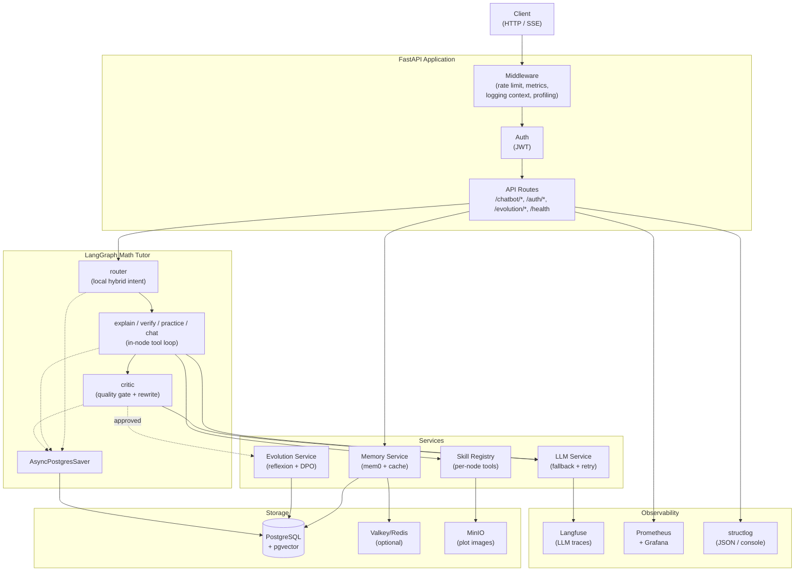
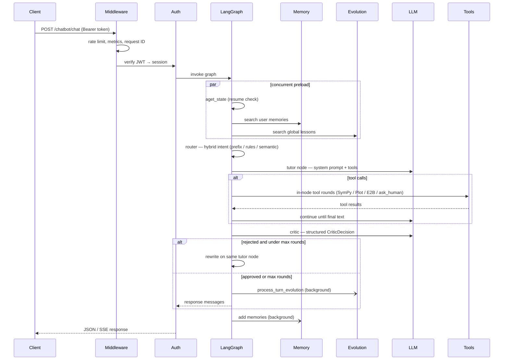
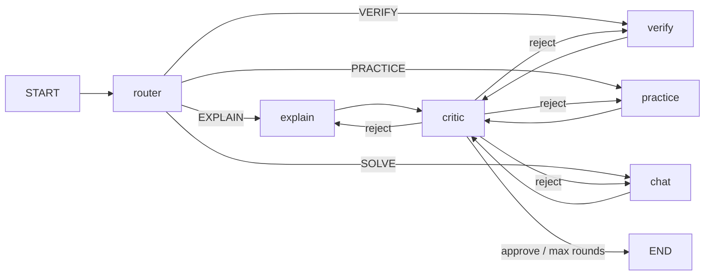

# Architecture

## System overview

## Request lifecycle

## Agent graph

The agent is a multi-node `StateGraph` with a single tool-loop style:

- **`router`** — local hierarchical hybrid router (prefix → keyword rules → char-ngram semantic → SOLVE fallback); no LLM call
- **`explain` / `verify` / `practice` / `chat`** — shared **in-node tool loop** (`run_tutor_with_tools`); tools come from `skill_registry` per node; always continue to `critic`
- **`critic`** — structured quality review; may rewrite via `Command(goto=tutor)` or terminate with `Command(goto=END)`
- **Checkpointer** — `AsyncPostgresSaver` persists `GraphState` per `thread_id` (session)

There is **no** separate graph-level `tool_call` node. Tool execution stays inside tutor nodes so all intents share one ReAct pattern.

Module layout:

| Module | Responsibility |
|---|---|
| `app/core/langgraph/graph.py` | Agent facade: pool, compile, invoke, stream |
| `app/core/langgraph/graph_builder.py` | Pure topology wiring (testable without DB) |
| `app/core/langgraph/nodes/` | `router`, `tutors`, `critic` handlers |
| `app/core/langgraph/helpers.py` | Shared pure helpers |
| `app/core/langgraph/models.py` | `CriticDecision`, intent map, status labels |
| `app/core/langgraph/message_processor.py` | Checkpoint → API `Message` turns |

## Key design decisions

**Memory search, evolution recall, and state check run concurrently.** On every non-resumed request, `aget_state`, `memory.search`, and `evolution.search_relevant_reflections` run in parallel with `asyncio.gather`.

**One tool-loop model for all tutors.** `explain` / `verify` / `practice` / `chat` all call `run_tutor_with_tools`. Chat no longer fans out to a graph-level `tool_call` node.

**Termination is explicit.** Critic uses `Command(goto=END)`. The builder does **not** call `set_finish_point`, so rewrite edges stay unambiguous.

**System / node prompts are template-cached.** Prompt files are read at import; per-request cost is formatting + optional skill / review / evolution injection.

**LLM fallback is time-bounded.** The fallback loop is wrapped in `asyncio.wait_for(timeout=LLM_TOTAL_TIMEOUT)`.

**Session titles add zero chat latency.** First message claims a placeholder name atomically, then a background nano-model task fills the real title.

## Component responsibilities

| Component | File | Responsibility |
|---|---|---|
| LangGraph Agent | `app/core/langgraph/graph.py` | Compile, invoke, stream, history |
| Graph builder | `app/core/langgraph/graph_builder.py` | Node destinations / entry point |
| Tutor nodes | `app/core/langgraph/nodes/tutors.py` | Unified in-node tool loop |
| Critic node | `app/core/langgraph/nodes/critic.py` | Quality gate + rewrite routing |
| Router service | `app/services/router.py` | Local intent classification |
| LLM Service | `app/services/llm/` | Model registry, retries, fallback |
| Memory Service | `app/services/memory.py` | mem0 semantic memory + cache |
| Evolution Service | `app/services/evolution.py` | Global lessons + DPO pairs |
| Skill Registry | `app/core/skills/registry.py` | Per-node tool / prompt guidance |
| Session Naming | `app/services/session_naming.py` | Background title generation |
| Database Service | `app/services/database.py` | User/session CRUD |
| Cache Service | `app/core/cache.py` | Valkey/Redis with in-memory fallback |
| Middleware | `app/core/middleware.py` | Metrics, logging context, profiling |
| Auth | `app/api/v1/auth.py` | JWT creation, session management |
